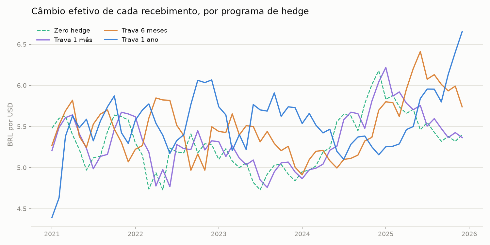

# Backtest de Hedge Cambial para Exportadores (USD/BRL)


## O problema

Uma exportadora recebe **USD 1 milhão todo mês**. Qual política de câmbio rende mais — e com menos sustos — ao longo de 5 anos: converter no spot, ou vender a termo com 1, 6 ou 12 meses de antecedência? Em vez de simular, este projeto responde com o que **de fato aconteceu** entre jan/2021 e dez/2025.

## Como o backtest funciona

Cada estratégia é um **programa rolante**: todo mês a empresa trava (ou não) a receita que vai chegar `k` meses à frente.

- **Zero hedge** — converte cada recebimento ao câmbio do mês (PTAX de fechamento).
- **Trava de k meses** (k = 1, 6, 12) — k meses antes do recebimento, vende USD a termo ao forward de paridade coberta de juros, com o CDI e o Treasury vigentes na data da trava:

  `F = S × ((1 + CDI) / (1 + Treasury)) ^ (k/12)`

A granularidade é mensal: o fechamento de cada mês serve de proxy para a data de trava e de liquidação.

## Resultado

| Programa | Total em 5 anos | Média/mês | Pior mês | vs. zero hedge |
|---|---|---|---|---|
| Zero hedge | R$ 318,5 mi | R$ 5,31 mi | R$ 4,73 mi | — |
| Trava de 1 mês | R$ 320,2 mi | R$ 5,34 mi | R$ 4,76 mi | **+R$ 1,7 mi** |
| Trava de 6 meses | R$ 329,1 mi | R$ 5,49 mi | R$ 4,91 mi | **+R$ 10,6 mi** |
| Trava de 1 ano | R$ 333,4 mi | R$ 5,56 mi | R$ 4,39 mi | **+R$ 14,9 mi** |

Três lições saem dos números:

1. **Quanto mais longa a trava, maior o prêmio embolsado.** Com o CDI entre 9% e 15% a.a. e o juro americano bem abaixo, o forward de 12 meses pagou de 4% a 10% acima do spot — e como o dólar terminou os 5 anos praticamente onde começou, esse carrego virou R$ 14,9 milhões de receita extra (~4,7% a mais que sem hedge).
2. **O hedge não ganha sempre.** A trava de 1 ano começou perdendo (contratos fechados em 2020 a ~4,40 liquidaram com o spot acima de 5) e devolveu ganhos em 2024, quando o dólar disparou a 6,18 e as travas antigas liquidaram abaixo do mercado. Quem mede o programa num único trimestre desiste na hora errada.
3. **O objetivo do hedge é previsibilidade, não a média.** Com a trava de 12 meses, a empresa conhece a receita em BRL de cada mês com um ano de antecedência — dá para assinar contrato de custo, orçamento e dívida em cima disso. O desvio-padrão mensal parecido entre as estratégias engana: na trava, a incerteza de cada mês é zero no momento em que ele é travado.



## Como rodar

```bash
pip install -r requirements.txt
pytest tests/                    # roda os testes
python scripts/run_backtest.py   # tabela-resumo + gráficos em assets/
```

## Estrutura

```
exporter-hedge-backtest/
├── src/
│   ├── backtest.py  # forward mensal, programas de trava rolante, resumo
│   ├── data.py      # painel mensal versionado + fetcher da API SGS do BCB
│   └── plots.py     # câmbio efetivo por programa, receita acumulada
├── data/
│   └── usdbrl_monthly.csv  # PTAX, CDI e Treasury 1a, mensal, 2019–2025
├── scripts/
│   └── run_backtest.py     # roda o backtest e gera os gráficos
└── tests/
    └── test_backtest.py
```

## Dados

Fechamentos mensais de USD/BRL (PTAX venda), CDI e Treasury de 1 ano em `data/usdbrl_monthly.csv` — valores aproximados compilados manualmente, suficientes para comparar estratégias, não para marcar carteira. `src/data.py` inclui um fetcher da API SGS do Banco Central (série 1 = PTAX, série 4389 = CDI a.a.) para substituir o CSV por dados oficiais.

## Conceitos aplicados

- **Paridade coberta de juros** — o forward como preço de não-arbitragem (Hull, cap. 5)
- **Cupom cambial / carry** — o diferencial de juros BRL×USD como prêmio pago ao exportador que trava
- **Programa de hedge rolante** — prática de tesouraria: travar a exposição de cada mês com antecedência fixa
- **Backtest vs. Monte Carlo** — este projeto complementa o `fx-forward-hedge`, que ataca o mesmo problema por simulação

## Próximos passos

- Substituir o CSV mensal por cotações oficiais diárias via API do BCB (o fetcher já está em `src/data.py`) e curva de Treasury por prazo (FRED)
- Travas parciais e escalonadas (ex.: 50% em 12m + 50% em 1m)
- NDF com ajuste financeiro em BRL, como o mercado brasileiro de fato opera
