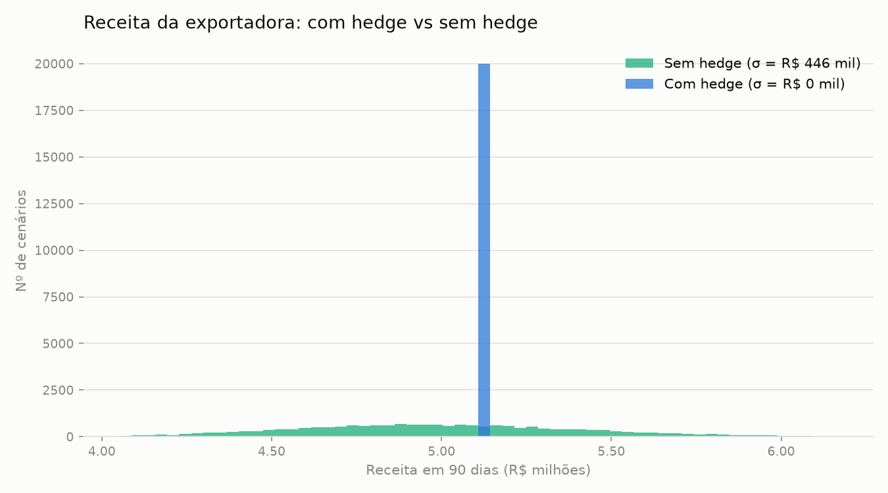
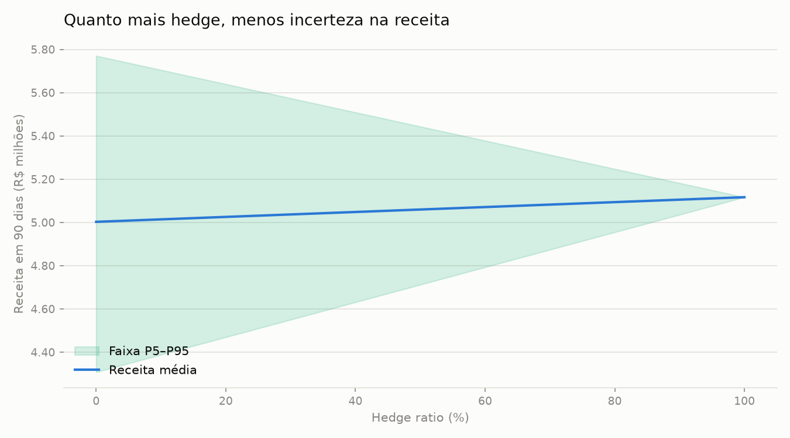
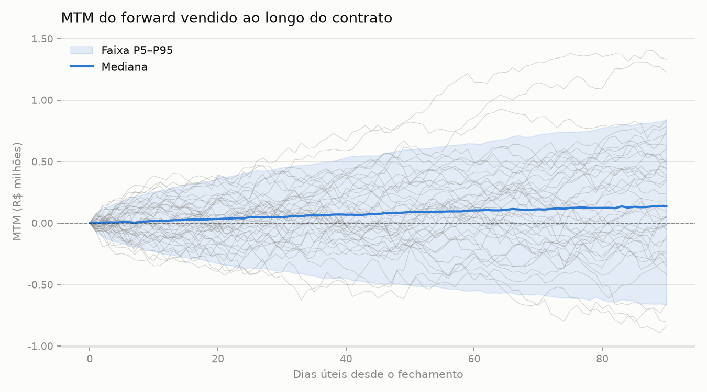
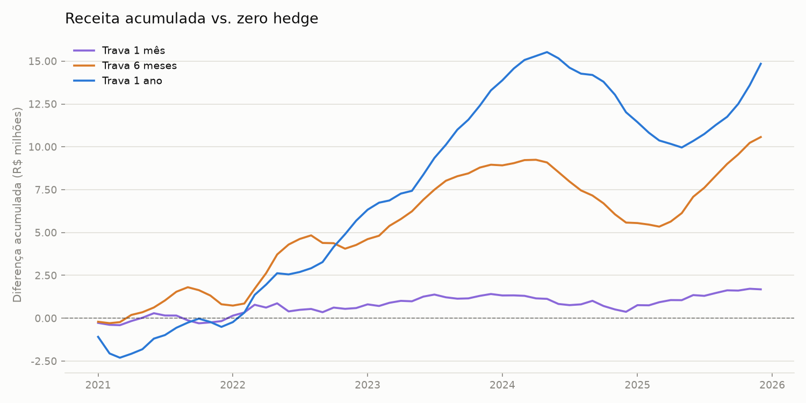

# Pricer de Forwards FX + Simulador de Hedge (USD/BRL)



## O problema

Uma exportadora brasileira vai receber **USD 1 milhão em 90 dias úteis**. Se o dólar cair até lá, a receita em reais encolhe — e a empresa não controla o câmbio. Este projeto precifica o forward de USD/BRL, marca o contrato a mercado ao longo da vida e quantifica, via Monte Carlo, quanto risco o hedge elimina.

## O que o projeto faz

- **Precifica forwards** via paridade coberta de juros com convenção brasileira (base 252 para o CDI)
- **Marca o contrato a mercado (MTM)** em qualquer data entre o fechamento e o vencimento
- **Simula 20.000 trajetórias** do USD/BRL por movimento browniano geométrico
- **Compara a receita com e sem hedge** — total, parcial (0%–100%) e **em camadas** (1/3 da exposição travado por mês, como tesourarias fazem na prática)
- Testes em `pytest` cobrindo preço, MTM e propriedades do hedge

## Resultado-chave

| Estratégia | Receita média | Desvio-padrão |
|---|---|---|
| Sem hedge | R$ 5,00 mi | **R$ 446 mil** |
| Hedge em camadas (1/3 ao mês) | R$ 5,09 mi | R$ 164 mil |
| Hedge 100% no dia 0 | R$ 5,12 mi | **R$ 0** |

O hedge de 100% **eliminou toda a volatilidade da receita** — e ainda elevou a média, porque o diferencial de juros BRL×USD faz o dólar a termo negociar com prêmio de 2,3% sobre o spot: no Brasil, o exportador **é pago para se proteger**. O hedge em camadas eliminou 63% da volatilidade mantendo flexibilidade.

<p>
  
  
</p>

## Backtest histórico: 5 anos exportando USD 1 mi/mês

E se, em vez de simular, olharmos o que **de fato aconteceu**? O backtest (`scripts/run_backtest.py`) pega uma exportadora que recebe USD 1 milhão todo mês, de jan/2021 a dez/2025, e compara quatro políticas: converter no spot (zero hedge) ou vender a termo com 1, 6 ou 12 meses de antecedência, ao forward de paridade coberta com o CDI e o Treasury vigentes na data da trava.

| Programa | Total em 5 anos | Média/mês | Pior mês | vs. zero hedge |
|---|---|---|---|---|
| Zero hedge | R$ 318,5 mi | R$ 5,31 mi | R$ 4,73 mi | — |
| Trava de 1 mês | R$ 320,2 mi | R$ 5,34 mi | R$ 4,76 mi | **+R$ 1,7 mi** |
| Trava de 6 meses | R$ 329,1 mi | R$ 5,49 mi | R$ 4,91 mi | **+R$ 10,6 mi** |
| Trava de 1 ano | R$ 333,4 mi | R$ 5,56 mi | R$ 4,39 mi | **+R$ 14,9 mi** |



Três lições saem do gráfico:

1. **Quanto mais longa a trava, maior o prêmio embolsado.** Com o CDI entre 9% e 15% a.a. e o juro americano bem abaixo, o forward de 12 meses pagou de 4% a 10% acima do spot — e como o dólar terminou os 5 anos praticamente onde começou, esse carrego virou R$ 14,9 milhões de receita extra.
2. **O hedge não ganha sempre.** A trava de 1 ano começou perdendo (contratos fechados em 2020 a ~4,40 liquidaram com o spot acima de 5) e devolveu ganhos em 2024, quando o dólar disparou a 6,18 e as travas antigas liquidaram abaixo do mercado. Quem mede o programa num único trimestre desiste na hora errada.
3. **O objetivo do hedge é previsibilidade, não a média.** Com a trava de 12 meses, a empresa conhece a receita em BRL de cada mês com um ano de antecedência — dá para assinar contrato de custo, orçamento e dívida em cima disso. O desvio-padrão mensal parecido entre as estratégias engana: na trava, a incerteza de cada mês é zero no momento em que ele é travado.


**Dados:** fechamentos mensais de USD/BRL (PTAX), CDI e Treasury de 1 ano em `data/usdbrl_monthly.csv` — valores aproximados compilados manualmente, suficientes para comparar estratégias, não para marcar carteira. `src/data.py` inclui um fetcher da API SGS do Banco Central (séries 1 e 4389) para substituir o CSV por dados oficiais quando houver rede.

## Como rodar

```bash
pip install -r requirements.txt
pytest tests/                          # roda os testes
python scripts/run_backtest.py         # backtest histórico 2021–2025
jupyter notebook notebooks/demo.ipynb  # caso completo, do preço ao P&L
```

## Estrutura

```
fx-forward-hedge/
├── src/
│   ├── pricing.py   # forward_price, forward_mtm
│   ├── hedge.py     # simulação Monte Carlo, P&L hedged/unhedged, hedge em camadas
│   ├── backtest.py  # backtest histórico de programas de trava (0/1/6/12 meses)
│   ├── data.py      # painel mensal versionado + fetcher da API SGS do BCB
│   └── plots.py     # histograma, MTM, P&L por hedge ratio, gráficos do backtest
├── data/
│   └── usdbrl_monthly.csv  # PTAX, CDI e Treasury 1a, mensal, 2019–2025
├── scripts/
│   └── run_backtest.py     # roda o backtest e gera os gráficos
├── notebooks/
│   └── demo.ipynb   # notebook narrativo com o caso da exportadora
└── tests/
    ├── test_pricing.py
    └── test_backtest.py
```

## Conceitos aplicados

- **Paridade coberta de juros** — o forward como preço de não-arbitragem, não como aposta (Hull, cap. 5)
- **Marcação a mercado** — valor presente da diferença entre forward contratado e vigente (Hull, caps. 2–3)
- **Movimento browniano geométrico** — simulação do câmbio com drift zero (martingale)
- **Hedge ratio** — trade-off linear entre incerteza e travamento (Hull, cap. 6)
- **Hedge em camadas e basis risk** — prática de tesouraria e os riscos residuais que o modelo idealiza

## Próximos passos

- Substituir o CSV mensal por cotações oficiais diárias via API do BCB (o fetcher já está em `src/data.py`) e curva de Treasury por prazo (FRED)
- NDF com ajuste financeiro em BRL, como o mercado brasileiro de fato opera
- Travas parciais e escalonadas no backtest (ex.: 50% em 12m + 50% em 1m)
