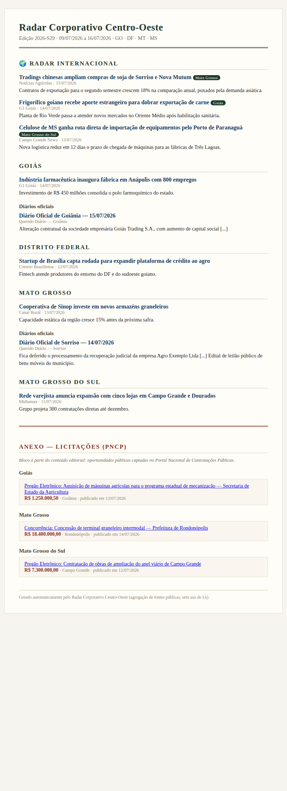

# Radar Corporativo Centro-Oeste

**Projeto 2: newsletter semanal de notícias corporativas de GO, DF, MT e MS**, com foco em
negócios internacionais — exportação, importação e recebimento de investimento estrangeiro.



## O problema

Acompanhar o ambiente de negócios do Centro-Oeste exige varrer dezenas de fontes todos os
dias: portais regionais, veículos nacionais de economia e agro, diários oficiais municipais
e o portal de contratações públicas. Este projeto agrega tudo isso em **uma edição semanal**,
gerada por um pipeline em Python — sem IA, agregação pura de fontes públicas.

## O que o pipeline faz

1. **Coleta** notícias de feeds RSS regionais (G1 dos 4 estados, Campo Grande News,
   Midiamax, Correio Braziliense) e nacionais de economia/agro (Valor Econômico, Exame,
   Globo Rural, Notícias Agrícolas, Canal Rural);
2. **Consulta APIs públicas oficiais**: licitações via [PNCP](https://pncp.gov.br) e
   diários oficiais municipais via [Querido Diário](https://queridodiario.ok.org.br)
   (capitais + polos do agro: Sorriso, Sinop, Nova Mutum, Rio Verde, Rondonópolis...);
3. **Filtra por relevância corporativa** (matching por palavra inteira, sem acentos) e
   marca com destaque os temas de comércio exterior e investimento estrangeiro;
4. **Atribui UF** a notícias de veículos nacionais quando citam estados/cidades da região;
5. **Deduplica entre edições** (`data/vistos.json`, retenção de 90 dias);
6. **Renderiza** a edição em HTML (auto-contido, pronto para e-mail) e Markdown.

### Estrutura da edição

| Bloco | Conteúdo |
|---|---|
| 🌍 Radar Internacional | Destaques de exportação/importação/investimento estrangeiro |
| Goiás · DF · Mato Grosso · Mato Grosso do Sul | Notícias corporativas regionais + trechos de diários oficiais |
| Anexo — Licitações (PNCP) | Bloco **segregado** do conteúdo editorial, agrupado por UF, com valor estimado |

## Fontes de dados

| Fonte | Tipo | Autenticação | Status |
|---|---|---|---|
| G1 (GO, DF, MT, MS) | RSS regional | nenhuma | candidata (checar) |
| Campo Grande News, Midiamax, Correio Braziliense | RSS regional | nenhuma | candidata (checar) |
| Valor, Exame, Globo Rural, Notícias Agrícolas, Canal Rural | RSS nacional | nenhuma | candidata (checar) |
| PNCP — contratações públicas | API REST | nenhuma | documentada (manual oficial) |
| Querido Diário — diários oficiais municipais | API REST | nenhuma | documentada (docs oficiais) |

Todas as fontes vivem em [`config/fontes.yaml`](config/fontes.yaml): adicionar ou remover
fonte, termo de filtro ou município **não exige mudança de código**.

## Como rodar

```bash
pip install -r requirements.txt

# 1) na primeira execução, valide os feeds RSS candidatos e pode o YAML:
python -m src --checar-fontes

# 2) gere a edição da semana (últimos 7 dias):
python -m src

# opções úteis
python -m src --inicio 2026-07-09 --fim 2026-07-16   # janela explícita
python -m src --fontes rss,pncp                      # subconjunto de fontes
python -m src --sem-licitacoes                       # sem o anexo do PNCP
python -m src --ignorar-dedup                        # regerar uma edição
```

A edição sai em `output/edicao-{ano}-S{semana}.html` e `.md`
([exemplo renderizado](assets/exemplo-edicao.md)).

```bash
pytest tests/        # suíte offline: fixtures locais, sem rede
```

## Estrutura

```
radar-corporativo-co/
├── config/fontes.yaml        # fontes, termos de filtro, territórios, modalidades
├── src/
│   ├── cli.py                # python -m src
│   ├── config.py             # YAML -> dataclasses
│   ├── models.py             # Item: contrato comum entre módulos
│   ├── fetchers/             # rss.py, pncp.py, querido_diario.py, http.py
│   ├── filtro.py             # relevância + atribuição de UF
│   ├── dedup.py              # estado entre edições
│   ├── pipeline.py           # coleta -> filtro -> dedup -> render
│   └── render.py             # Jinja2 -> HTML + Markdown
├── templates/                # edicao.html.j2, edicao.md.j2
└── tests/                    # pytest, 40 testes, tudo offline
```

## Decisões e limitações

- **Feeds RSS são candidatos até a primeira execução real** — o ambiente onde o projeto
  foi desenvolvido bloqueia rede externa, então as URLs vêm de padrões conhecidos e são
  validadas com `--checar-fontes` (Valor/Exame podem exigir ajuste por paywall).
- **Querido Diário tem cobertura municipal**, não estadual: usamos capitais + polos
  econômicos como proxy. A cobertura de cada município pode ser conferida no endpoint
  `/cities` da API.
- **PNCP exige o código da modalidade** na consulta; os códigos configurados (pregão
  eletrônico e dispensa) devem ser conferidos no
  [Swagger da API](https://pncp.gov.br/api/consulta/swagger-ui/index.html).
- Falha em uma fonte **não derruba a edição**: a fonte entra no rodapé
  "fontes indisponíveis" e o restante segue.

## Próximos passos

- [ ] Envio automático por e-mail (Resend/Brevo) para lista de assinantes
- [ ] Agendamento semanal via GitHub Actions
- [ ] Ranking de relevância (valor da licitação, recorrência de empresa citada)
- [ ] Página de arquivo das edições (GitHub Pages)
- [ ] Novas fontes: juntas comerciais, Comex Stat (dados de exportação por município)
